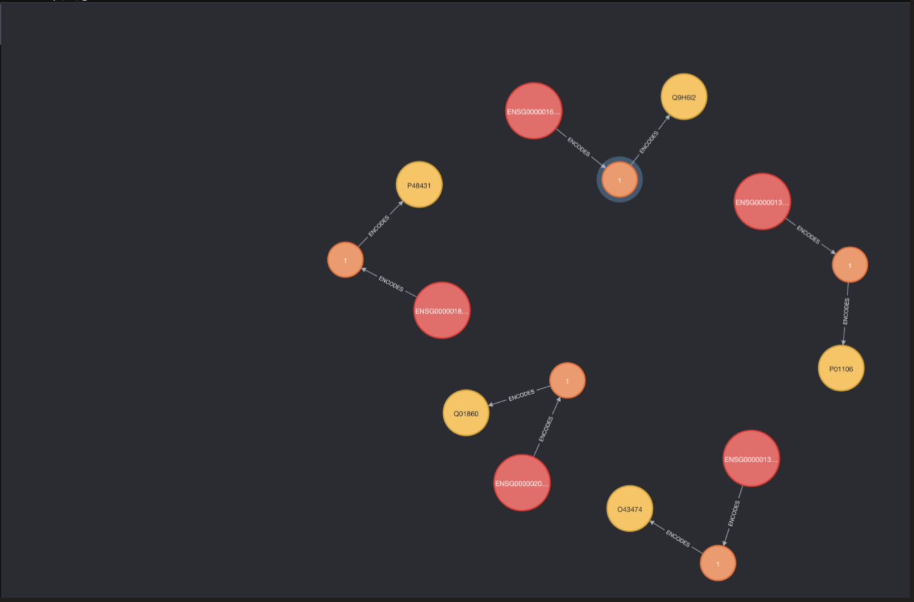

# A note on representing isoforms in the graph TF project.
### last updated - June 17 2022, Samuel Salitra
This document details some considerations for representing transcription factor isoforms in graphical form and the current approach being taken to do so. 

## Intro
Any biological model, no matter how sophisticated, cannot completely map to its target system. Every model has to balance faithful representation with conciseness and usability. A valuable model has to (1) capture part of a real system in a (2) rigorous and scientifically valid way that is (3) useful to the end user (other scientists). Our graphTF project is somewhere in the middle between a model and a data repository. Consequently, we must let the following contraints inform the design of the model:
  1. We will represent: Genes and transcripts which encode a set of TFs. The structure of each TF. DNA-TF & TF-TF interactions. More may be added.
  2. We will ensure rigour/validity by: Only ingesting TF annotations from other widely-used data respositories. This data will be structured in a valid way.
  3. It will be useful because:It provides scientists with a quantitative similarity measure with which to compare any two TFs.

## Considerations for modelling isoforms
Point number 2, ensuring that our model is scientifically valid, is especially important when it comes to representing the central dogma of biology. Different versions of a gene present at a locus may each encode multiple transcripts which may in turn encode multiple proteins. Each of these proteins may have different functional and structural characteristics. Mapping out the production of each protein will therefore add a large amount of information to GraphTF. We must decide how much of it is actually useful for our purposes.

## Attempting to model all isoforms
It could be argued that our graph is incomplete without representing all protein isoforms due to their different functional roles. So, this is my attempt to perform this complete modelling for the following set of yamanaka TF: ["KLF4", "MYC", "SOX17", "SOX2", "POU5F1"]

1. 1:1 mapping between TF name->uniprot/Swiss-prot IDs using uniprotKB search function
2. 1:1..* mapping between uniprot/Swiss-prot ID->Ensembl Gene ID using ensembl:biomart tool. All proteins but POU5F1 mapped to a single gene. POU5F1 mapped to 7 genes at the same locus.
3. 1:1..* mapping between Ensembl Gene ID->Ensembl Transcript ID/Ensembl Protein ID. 11 Genes mapped to 34 transcripts. Each transcript mapped to a single, unique ensembl protein (34 protein IDs total)
4. 1..*:1 mapping between Ensembl protein stable ID->Uniprot Uniparc ID using the uniprot ID mapping tool. Each uniparc ID had multiple associated ensembl IDs, creating X proteins.
5. Finally, 1:1...* mapping between Uniparc ID->UniprotKB Entry IDs. All Uniparc IDs had one manual entry in UniprotKB or at least one automatic entry, or both. Some uniparc IDs mapped to a specific protein isoform.

This mapping process resulted in the following gene->transcript->protein graphs for each TF.

As you can see, it can get pretty messy. We chose to limit annotations to a single gene for each TF. Consequently, we needed a "canonical" gene for each TF in order to standardize annotations. This was chosen to be the "primary" sequence as designated by ensembl. We also chose a canonical protein by using the canonical transcript as designated by ensembl. These choices resulted in the following canonical gene->protein associations in the graph:

## Going forward
We plan to only use these canonical pathways in the graph for all TFs. This was chosen to streamline the knowledge base. However, it will still be possible in the future to extend the graph to include all isoforms of proteins if we desired to. 

Please use the above workflow to help with the integration.
